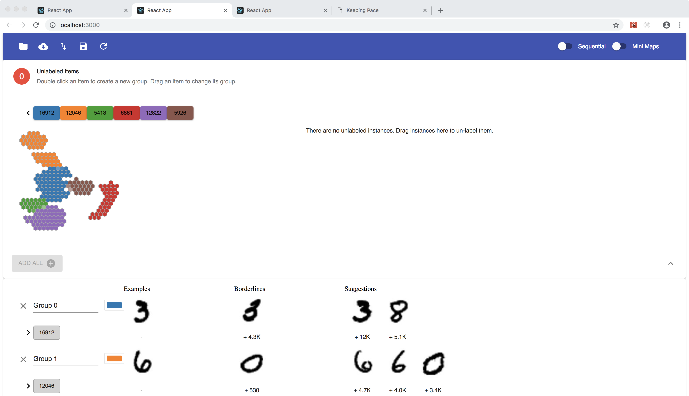

# Introduction 

Welcome to CHISSL, an interactive machine learning prototype. It is designed to provide a novel, simpler way for non-expert users to quickly and effortlessly explore large datasets without becoming overwhelmed.



The system provides a few recommendations to start with. Then, the user can double-click on one or more instances to create a group. For each group the user has created, CHISSL will recommend a few more things for the user to look at that it thinks is most similar to the examples(s) the user has provided. More than one example can be provided per group, and the user is free to correct the recommendations when they do not agree with her mental model.

CHISSL also recommends a borderline instance for each group to check out. Borderlines are likely to belong in another group.

Clicking below instances will show more instances on the sidebar that are similar to that example. Bars on the time histogram will similarly reveal instances within that time window.


# Getting Started
## Dependencies
Install MongoDB. For example, on MacOS the easiest way to do this is with [Homebrew](https://brew.sh), by running the following command.

```bash
brew install mongodb
```

Install a [python 3.5 environment](https://www.anaconda.com/download/) with the following packages
* pymongo
    * if using Anaconda, this is the only additional dependency (use **conda install pymongo**)
* flask
* scikit-learn
* pandas
* umap-learn

Install the chissl package
```bash
cd python-chissl
python setup.py install
```

If you plan to modify the chissl python source code, you may find it convenient to instead install the package with `develop`, which creates symbolic links back to the files in chissl-python, allowing changes to be reflected without re-installing the package. To do so:
```python
cd python-chissl
python setup.py develop
```

Note: umap-learn is best installed using the following command
```bash
conda install -c conda-forge umap-learn
```

Install the [node.js](https://nodejs.org/en/) dependencies
```bash
cd react-chissl
npm install
```

## Startup
Start the development server
```bash
cd react-chissl
npm start
```

Go to [localhost:3000](http://localhost:3000)

To run in `production` mode, you should build the web assets using
```bash
npm run build
```

The API server can be started using
```bash
python -m chissl.server --port=9876
```

The front end server can be started using
```bash
cd react-chissl
node server.js 3000 http://localhost:9876
```

Note: the ports used for the API and front end servers are arbitrary, but the API port should be passed to the front end server so it can proxy the data correctly.


# Adding Applications
The CHISSL back-end has the following important concepts:
* Applications
* Collections
* Components
* Pipelines
* Models

## Back-End
An application is the association of a collection, component, and a pipeline. A model is a specific instantiation of a pipeline that has been fit on some existing data (from a collection).

First, add your data to a collection. Let's assume our data is stored as a list of python dictionaries called `docs.` See `python-chissl/applications/Digits.ipynb` for the code to generate the docs array. CHISSL has a convenience function that calls the pymongo insert_many function. Data can be inserted using this as follows:

```python
from chissl.util import chissl_mongo as cm
chissl = cm.ChisslMongo(verbose=True)
chissl.create_collection('Digits-data', docs, drop=True)
```

This creates a collection called 'Digits-app'. Next we will create an application that associates the digits data with the application we are creating. It also points to the visualization component (ImageComponent) and pipeline (SimplePipeline) we are using for this application.

```python
chissl.create_application('Digits-app',
                          'Digits-data',
                          'ImageComponent',
                          'chissl.pipelines.mnist.SimplePipeline',
                          drop=True)
```

Note: pipelines are scikit-learn pipline objects. They can be imported from anywhere. For example, relative to where you run `python -m chissl.server`.

A new model can be via the user interface, or programmatically. To create a model for this dataset, do the following:
```python
chissl.create_model('Digits-app', 'test', drop=True)
```

This returns some useful information, including a 2-D projection of each document in `docs`.


## Front End
* src/components/icons/MyNewComponent.js
* src/components/icons/index.js

Create a React component to render your instance. The component will be passed the instance document directly from the database as props.

```jsx
import React from 'react';

import './MyNewComponent.css'

export const MyNewComponent = ({_id, date, tags, ...rest}) =>
    <div className='my-new-component'>
        <div>{_id}</div>

        <div>{date}</div>

        <div>{tags}</div>

        Secret sauce goes here.
    </div>
```

If you want to use CSS, create `MyNewComponent.scss` namespaced as shown below. This will be automatically compiled into a CSS file which you include in the component. Don't include the .scss file.

```scss
.my-new-component {
  div {
    font-family: "Comic Sans MS";
  }
}
```

Export your component in `src/components/icons/index.js`.

```js
export {MyNewComponent} from './MyNewComponent';
```

# Restoring Bundled Data
Some applications and data is bundled with CHISSL to make getting started easier. This can be restored to the MongoDB as follows:
```bash
mongorestore --gzip --archive=dumps/chissl
```